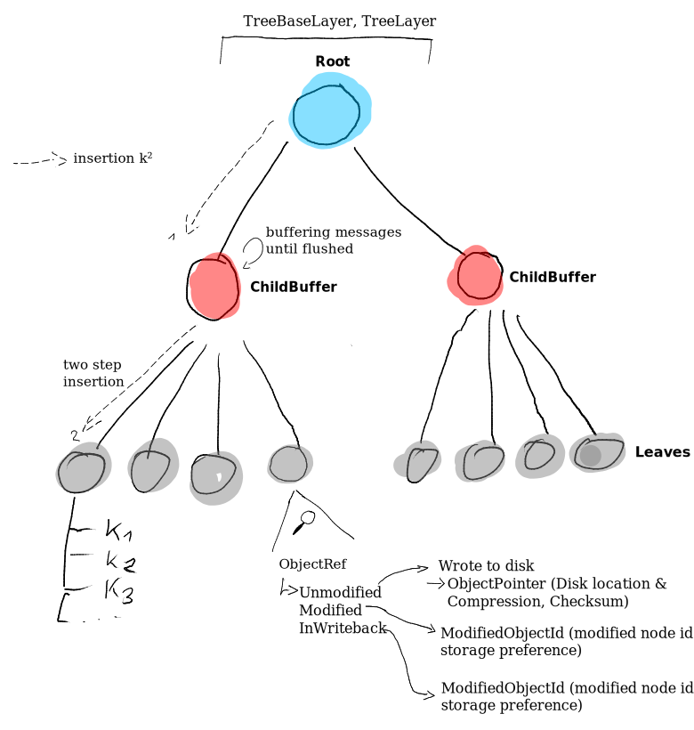
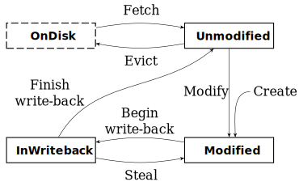

# betree

## Building

```sh
$ cargo build
```

## Tests

### Integration

Navigate to `./tests/`

```sh
$ cargo test -- --test-threads 4
```

> It is advised to use a limited number of jobs for testing all scenarios as some use up to 2 GiB of main memory.
> `your_main_memory_in_gb / 2 = number_of_test_jobs`


### Internal

From the `betree` directory run

```sh
$ cargo test
```

> Some test cases observe erroneous behavior at the moment and timeout after 60 seconds.

## Overview


### Database, Dataset and Object store

At the top of the overview, see above, we can see the _user interface_ part
of _Haura_. The `Database` provides the main introduction here for the rest of
the modules to be used. From an active `Database` we can then initiate a
`Dataset` or `Objectstore`. Also notable from the graphic, the `Database`
creates the `AllocationHandler` which is subsequently used in the
`DataManagement`. The `Database` also contains due to this also the storage
configuration which is then initiated in the `StoragePool`. The implementation
of the `Objectstore` is a wrapper around `Dataset` whereas the keys are chunk
ids and the value is there chunk content.

### Bε-tree



The `Dataset` interacts mainly with the actual Bε-tree, which
receives through its root node messages from the `Dataset`. By default these
implement _insert_, _remove_ and _upsert_, although this can be exchanged if
required. Solely the `MessageAction` trait is required to be implemented on the
chosen type to allow for its use in the tree. An example for this can be seen in
the `MetaMessage` of the `Objectstore`.
Once passed, the tree propagates the message down the tree until it reaches a
leaf node where the message will be applied. Though this, might not happen
instantaneously and multiple buffers (`ChildBuffer`s) might be encountered which momentarily hold
the message at internal nodes. This way we avoid additional deep traversals and
might be able to flush multiple messages at once from one buffer node.

Vital to understanding the handling and movement of nodes and their content
within _Haura_ is the object state cycle, this is illustrated at the leaf nodes
and in more detail in the following figure.



Notable, is the additional state here labeled "On Disk", this is _strictly_
speaking not a state in the implementation of `ObjectRef` as-is but a state one
might differentiate two `ObjectRef`s by, as its simply denoting if the data has
to be read or is already present in the `Cache`.

### Data Management

On-disk operations and storage allocation are handled by the Data Management
layer. This layer also implements the copy-on-write semantics required for
snapshots, done in delayed deallocation and accounting of a dead-list of blocks.

Most important here is the `Dml` traits (`Dml`, `DmlBase`, `DmlWithHandler`,
`DmlWithCache`, `DmlWithSpl`) and the `Handler` trait. (`Cache` and `Spl` are
part of different modules and layers).

The `Handler` manages the actual bitmap handling for all allocations and
deallocations and is also responsible for tracking the number of blocks
distributed (Space Accounting).

### Storage Pool

As the abstraction over specific hardware types and raid configurations the data
management unit interacts for all IO operation with the storage pool layer.

Notable here is the division of the layer into (of course) storage tiers, `Vdev`
and `LeafVdevs`.  There are 4 storage tiers available
(`FASTEST`,`FAST`,`SLOW`,`SLOWEST`) with each at maximum 1024 `Vdev`s.  Each
`Vdev` can be one of four variants. First, a singular `LeafVdev`, this is the
equivalent of a disk or any other file path backed interface, for example a
truncated file or a disk `dev/...`. Second, a RAID-1 like mirrored
configuration. Third, a RAID-5 like striping and parity based setup with
multiple disks. Fourth and last, a main memory backed buffer, simply hold as a
vector.

## Implementation

There are multiple modules with interweaving functionality
in `betree`, we will quickly name and describe them here.

| Name            | Description                                                                                                        |
|:----------------|:-------------------------------------------------------------------------------------------------------------------|
| cache           | Clock Cache implementation used internally                                                                         |
| compression     | Compression logic for indication and usage of compression algorithm (zstd only atm)                                |
| data_management | Allocation and Copy on Write logic for underlying storage space                                                    |
| database        | The Database layer & Dataset implementation with snapshots                                                         |
| metrics         | Basic Metric collections                                                                                           |
| object          | The object store wrapper around the dataset store                                                                  |
| storage\_pool   | The storage pool layer which manages different vdevs                                                               |
| tree            | The actual b-epsilon tree                                                                                          |
| vdev            | Implement the use of different devices for storage (Block, File, Memory) with different modes parity, raid, single |

> Note that traits are heavily used to allow interaction between objects of different modules, traits implemented by one module might be located in multiple other modules.

## Known bugs
- On large write operations (easy to achieve with `Objectstore`) which overfill the storage can return unexpected errors, this has been reduced by the introduction of space accounting but some errors might still occur as not all checks have been implemented yet.
- Not all tests finish successfully at the moment; both in internal and integration tests
  - Integration: Overwriting existent data fails due to semantics of the tree and intermediate message buffering in internal nodes which may overstep the actual available storage size
  - Internal: `parity1` tests fail, due for investigation
