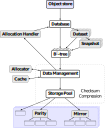

# betree

## Building

```sh
$ cargo build
```

## Tests

Navigate to `./tests/`

```sh
$ cargo test -j 4
```

> It is advised to use a limited number of jobs for testing all scenarios as some use up to 2 GiB of main memory.
> `your_main_memory / 2 = number_of_test_jobs`

Some test cases observe erroneous behavior at the moment and timeout after 60 seconds.

## Overview



There are multiple modules with interweaving functionality
in `betree`, we will quickly name and describe them here.

| Name            | Description                                                                                                        |
|:----------------|:-------------------------------------------------------------------------------------------------------------------|
| cache           | Clock Cache implementation used internally                                                                         |
| compression     | Compression logic for indication and usage of compression algorithm (zstd only atm)                                |
| data_management | Allocation and Copy on Write logic for underlying storage space                                                    |
| database        | The Database layer & Dataset implementation with snapshots                                                         |
| metrics         | Basic Metric collections                                                                                           |
| object          | The object store wrapper around the dataset store                                                                  |
| storage\_pool   | The storage pool layer which manages different vdevs                                                               |
| tree            | The actual b-epsilon tree                                                                                          |
| vdev            | Implement the use of different devices for storage (Block, File, Memorr) with different modes parity, raid, single |

> Note that traits are heavily used to allow interaction between objects of different modules, traits implemented by one module might be located in multiple other modules.
