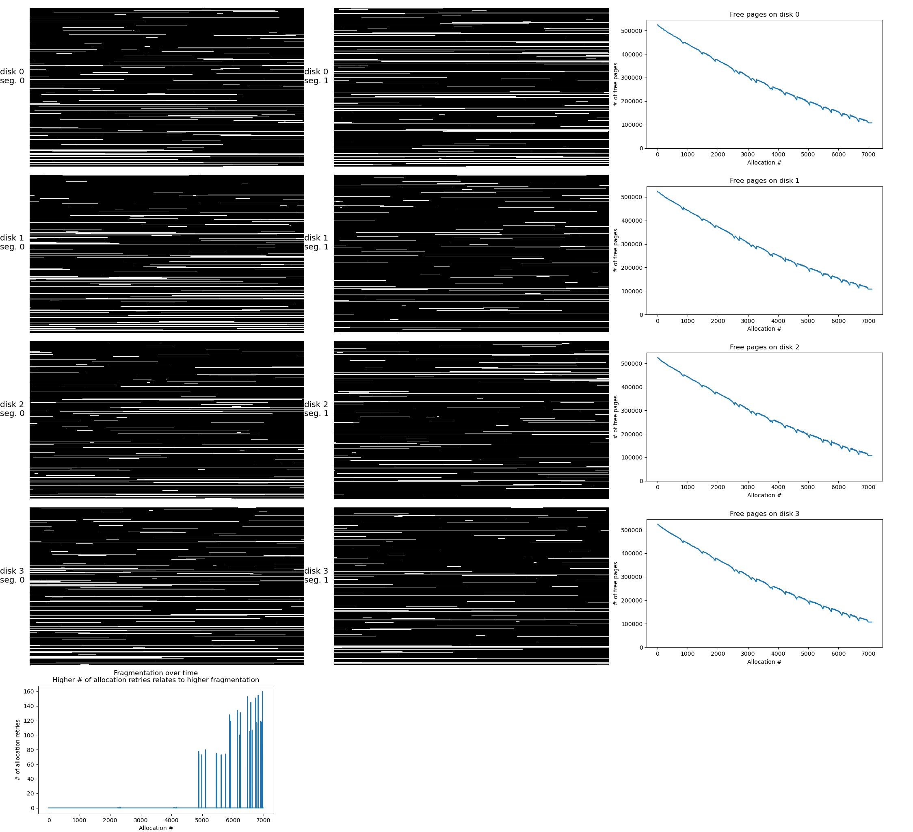

# Debug Plots

Haura supports additional debugging information when compiling with the
`debug_*` features. These highlight different internal processes or states of
the database which can then be further analyzed, for example, with the scripts
in `haura_debug_plots` which produce plots and videos which show the evolution
of the database over time.

## Debug Allocations

This debug measure documents the timeline of all allocation bitmaps *of the
first* tier.  The data written out is potentially huge with several tens or
hundred gigabytes when not using small (<=8 GiB) setups in total storage space.

For each allocation a json timestamp is written in the `logs/` directory in the
current working directory.[^1] Once the execution has finished and the database
is closed (on success or otherwise), the data is ready to be processed by the
accompanying plotting script, which can be found in
`haura-debug-plots/debug_allocations.py`. This script creates all plots of all
timestamps, and joins them into a video at the end.[^2]

```sh
$ # some haura run has been performed to this point..
$ cd logs
$ ../../haura-debug-plots/debug_allocations.py
```

> This process may take some time creating load on all available cores and
> create for long runs a significant amount of images. They are encoded to jpeg
> in an attempt to save storage space.

An example can be seen below which show a highly fragmented storage setup after
some random write operations.



[^1]: Directories are created if not present.

[^2]: You'll need `ffmpeg` with the `libx264` encoder for this.
